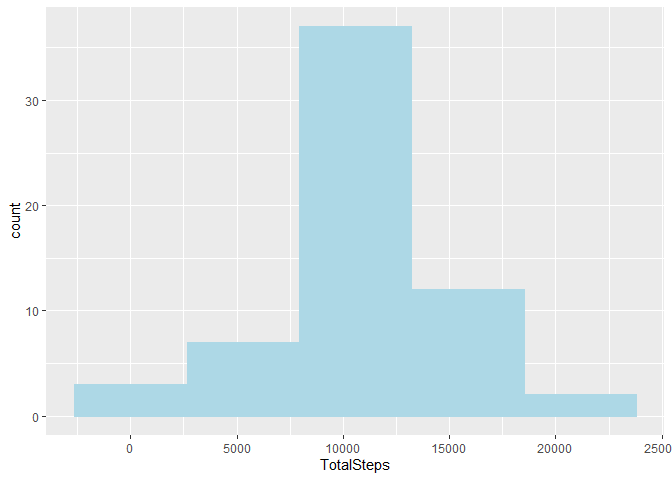

This document is made as an assignment for the John Hopkins reproducible research course. 

## Loading and preprocessing the data
The following code unzips the data, and reads it in, and transforms the date variable from a string into a date. This assumes the activity.zip file is in your working directory.


```r
unzip("activity.zip")
activity <- read.csv("activity.csv")
activity$date <- as.Date(activity$date)
```

## What is mean total number of steps taken per day?

To calculate the total number of steps by day we use tapply. For the histogram we use ggplot2 with bins of 5.


```r
library(ggplot2)
TotalSteps <- as.data.frame(tapply(activity$steps,activity$date, sum, na.rm=TRUE))
colnames(TotalSteps) <- "TotalSteps"

ggplot(TotalSteps, aes(x=TotalSteps))+
    geom_histogram(bins = 5, color = "lightblue",fill="lightblue")
```

<!-- -->

We can calculate the mean of the total amount of steps taken per day easily with the document, by using back ticks and r, like this:

The mean of total steps taken per day is 9354.2295082.

The downside is that this code is not reproduced within the document. In order to do that we have to work with code chunks. The following code thus produces first the mean and then the median of the total amount steps taken per day. Missing values are ignored for now as per the assignment.


```r
mean(TotalSteps$TotalSteps)
```

```
## [1] 9354.23
```

```r
median(TotalSteps$TotalSteps)
```

```
## [1] 10395
```


## What is the average daily activity pattern?

For this we first calculate the mean activity per five minute interval. This will be the data that we plot.


```r
x <- tapply(activity$steps, activity$interval, mean, na.rm = TRUE)
intervalsteps <- as.data.frame(x)
colnames(intervalsteps) <- "Average_Steps"
intervalsteps$Interval <- rownames(intervalsteps)
plot(intervalsteps$Interval,intervalsteps$Average_Steps, typ= "l", xlab = "Interval", ylab = "Average Steps")
```

<!-- -->

In the previous code block we made a data frame which tells us he average steps per interval, and we can use this data frame to see which interval has the highest amount of average steps.


```r
intervalsteps$Interval[intervalsteps$Average_Steps==max(intervalsteps$Average_Steps)]
```

```
## [1] "835"
```

835 is the starting minute (as the intervals start at 0). If we assume the intervals start at midnight, the interval 835 - 840 corresponds to 13:55 - 14:00. A good time for a walk apparently.

## Imputing missing values

We have yet to deal with the missing values in the data set. Lets have a look at how many rows have missing values


```r
sum(!complete.cases(activity))
```

```
## [1] 2304
```

That represent 13.11% of the total cases.

We'll handle the missing steps by taking the mean value for the specific interval. We already have this data ready and can use the merge function to add it in, the eastiest way to do this is to actually first split it up into two dataframes, one with missing values, and one without. As the amount of steps can only be a round number we'll use the rounded value instead of the true mean. We will first need to rename the interval column in the earlier created dataframe to give it the same name as the column in the activity set.


```r
x <- colnames(intervalsteps)
x[2] <- "interval"
colnames(intervalsteps) <- x
intervalsteps$Average_Steps <- round(intervalsteps$Average_Steps)

activitymissing <- activity[is.na(activity$steps),]
activity2 <- activity[!is.na(activity$steps),]
activitymissing <- merge(activitymissing, intervalsteps, by = "interval")
activitymissing$steps <- activitymissing$Average_Steps
activitymissing$Average_Steps <- NULL

activity2 <- rbind(activity2,activitymissing)
```

To create the histogram for this data we simply rerun the code from the first histogram with this data. We shall also directly calculate the mean and median.


```r
TotalSteps2 <- as.data.frame(tapply(activity2$steps,activity2$date, sum))

colnames(TotalSteps2) <- "TotalSteps"

ggplot(TotalSteps2, aes(x=TotalSteps))+
    geom_histogram(bins = 5, color = "lightblue",fill="lightblue")
```

<!-- -->

```r
mean(TotalSteps2$TotalSteps)
```

```
## [1] 10765.64
```

```r
median(TotalSteps2$TotalSteps)
```

```
## [1] 10762
```

This does appear to have rather drastically changed the mean steps by day. The set with the estimated missing values has on average almost 1400 steps per day more. The median changed around 400.

Let's have a quick look if this difference is statistically significant.


```r
t.test(TotalSteps[,1], TotalSteps2[,1])
```

```
## 
## 	Welch Two Sample t-test
## 
## data:  TotalSteps[, 1] and TotalSteps2[, 1]
## t = -1.6429, df = 110.2, p-value = 0.1032
## alternative hypothesis: true difference in means is not equal to 0
## 95 percent confidence interval:
##  -3113.8778   291.0581
## sample estimates:
## mean of x mean of y 
##   9354.23  10765.64
```
As the reported p value is above 0.1 we haven't changed the mean to badly it appears.

## Are there differences in activity patterns between weekdays and weekends?

In order to answer this question we will first need to add the weekdays to the dataframe, and then change this to weekday and weekend.


```r
activity2$weekday <- weekdays(activity2$date)
activity2$weekday[activity2$weekday == "Saturday" |activity2$weekday == "Sunday"] <- "weekend"
activity2$weekday[activity2$weekday!="weekend"] <- "weekday"
activity2$weekday <- as.factor(activity2$weekday)
activity2$weekday <- factor(activity2$weekday, levels = c("weekday","weekend"))
meansteps <- aggregate(activity2$steps, by = list(activity2$interval, activity2$weekday), FUN = mean)
colnames(meansteps) <- c("interval","weekday","meansteps")
ggplot(meansteps, aes(x = interval, y= meansteps)) +
    geom_line(color = "steelblue") +
    facet_wrap(weekday~.,nrow= 2) +
    labs(title = "Weekend and weekday difference in steps", y="Average number of steps")
```

<!-- -->

This shows us that there is indeed a bit of difference between weekday and weekend step counts. Weekend step counts appear to be lightly less concentrated around the earliest peak. 

